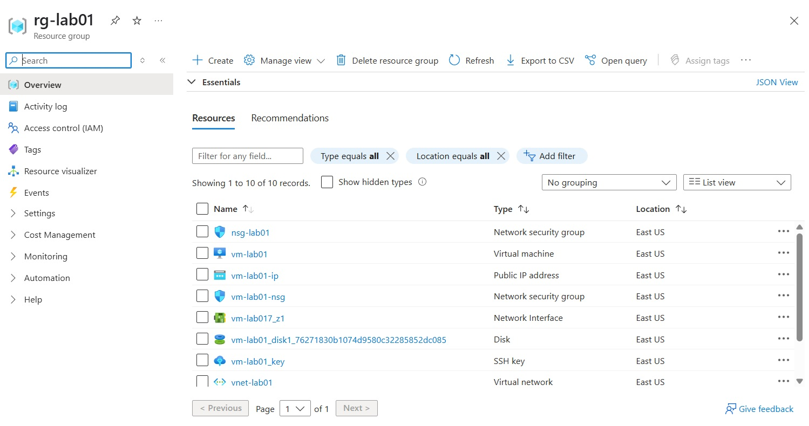
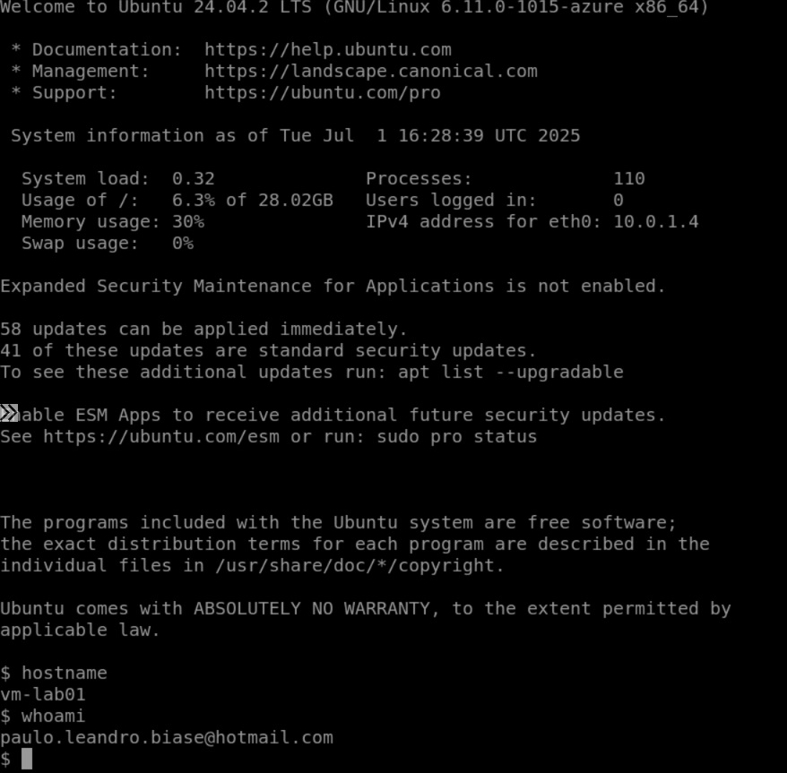

# 💻 Azure Lab 01 – Criação de VM Linux com VNet, NSG e acesso via Bastion

## 🎯 Objetivo

Criar uma máquina virtual Linux no Microsoft Azure com:
- Rede Virtual (VNet)
- Sub-rede personalizada
- Grupo de Segurança de Rede (NSG)
- Conexão segura via Azure Bastion (sem expor IP público da VM)

---

## 🔧 Recursos Criados

| Recurso              | Nome              |
|----------------------|-------------------|
| Grupo de recursos    | `rg-lab01`        |
| VNet                 | `vnet-lab01`      |
| Sub-rede da VNet     | `subnet-lab01`    |
| Grupo de Segurança   | `nsg-lab01`       |
| Máquina Virtual      | `vm-lab01`        |
| Azure Bastion        | `bastion-lab01`   |

---

## 🧪 Passo a passo realizado

### 1. Criação da Rede Virtual
- Nome: `vnet-lab01`
- Sub-rede: `subnet-lab01` com endereço `10.0.0.0/24`

### 2. Criação do NSG
- Nome: `nsg-lab01`
- Regras aplicadas:
  - (opcional) Permitir SSH (porta 22) – **não necessário com Bastion**
  - Permitir saída para internet

### 3. Criação da VM Linux
- Nome: `vm-lab01`
- Imagem: Ubuntu 22.04 LTS
- Tamanho: Standard B1s
- Autenticação: chave SSH ou senha
- Rede: associada à `vnet-lab01` e `subnet-lab01`
- Associada ao `nsg-lab01`

### 4. Acesso via Azure Bastion
- Nome: `bastion-lab01`
- Criada sub-rede especial: `AzureBastionSubnet`
- IP público dedicado ao Bastion
- Conexão feita pelo portal do Azure diretamente no navegador, com usuário/senha ou chave

---

## 📸 Evidências (prints)

